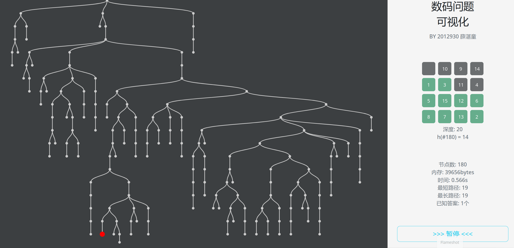

# Digit Problem
Visualize the search tree for 8/15 digits problem with d3.js in a web page. Searching algorithms including bfs, dfs(with maximum depth), heuristic search are provided. Users could choose begin and end states.

### Preview: Configuring searching algorithms


### Preview: Visualizing the search tree


## Project setup
```
npm install
```

### Compiles and hot-reloads for development
```
npm run serve
```

### Compiles and minifies for production
```
npm run build
```

### Lints and fixes files
```
npm run lint
```

### Customize configuration
See [Configuration Reference](https://cli.vuejs.org/config/).
